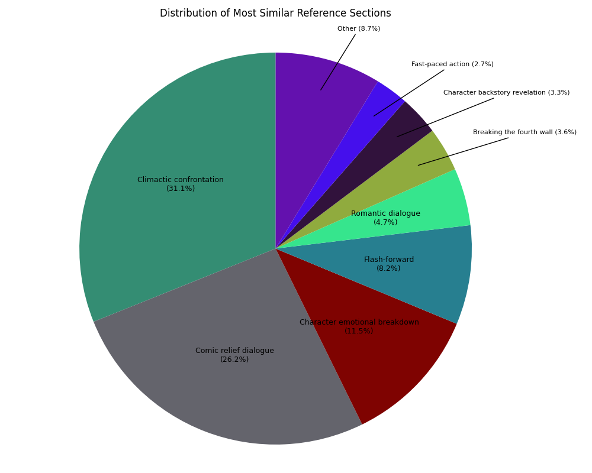
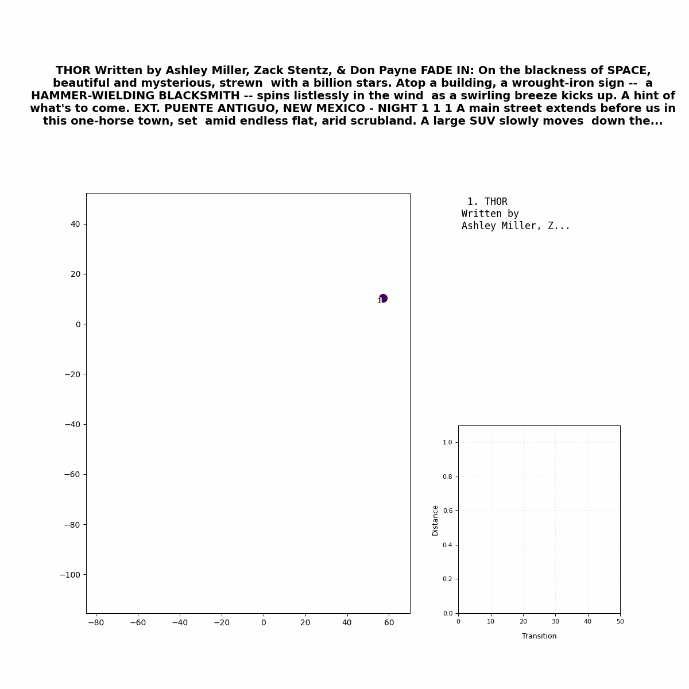
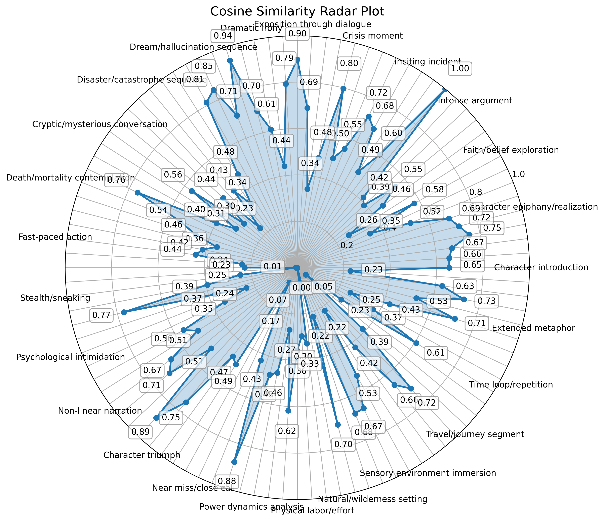
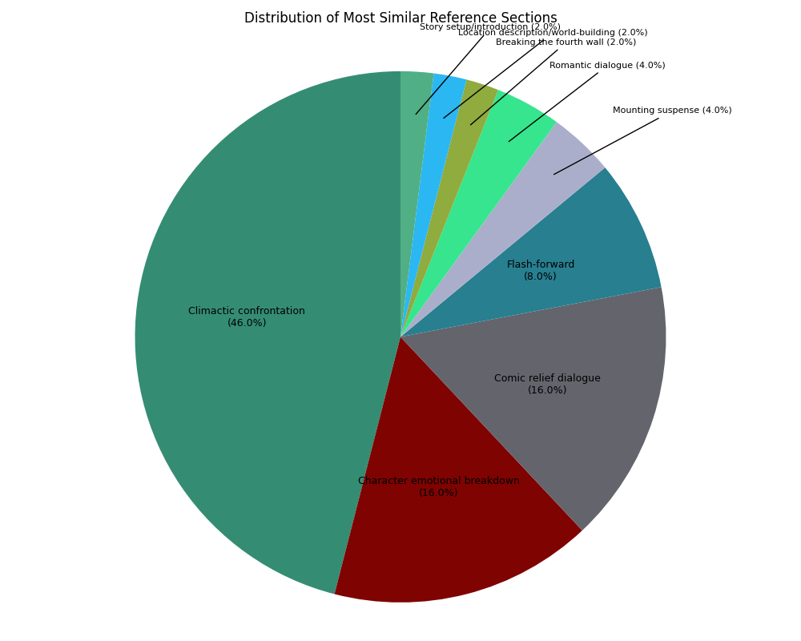
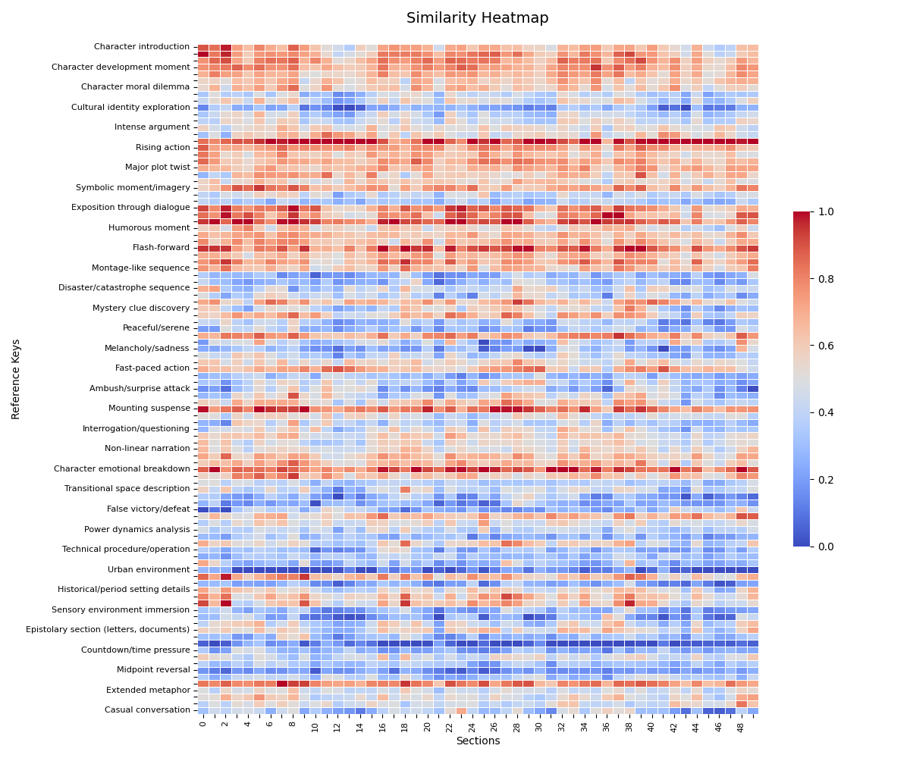
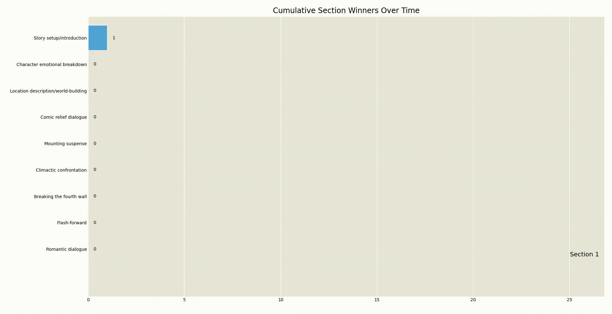
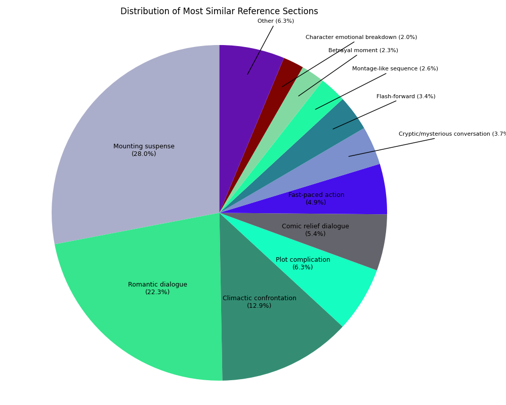
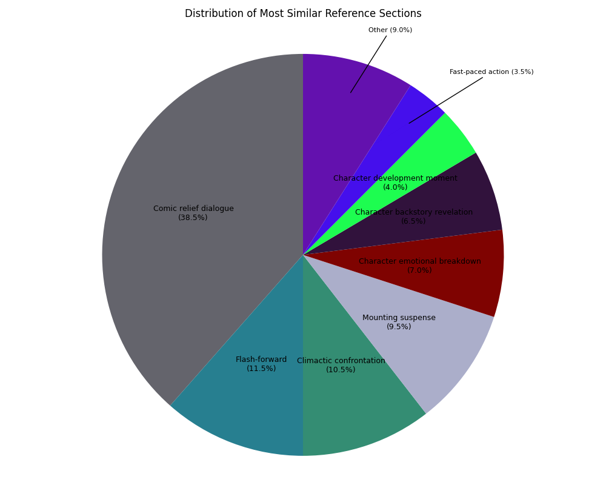

# Morphology of a Marvel Movie

In 1928, Soviet scholar Vladimir Propp wrote "Morphology of the Folktale". Propp's Morphology itemized core functions of the folktale, common events like:

- "Departure – The hero leaves the home environment, this time with a sense of purpose. Here begins their adventure."
- "Struggle – The hero and villain meet and engage in conflict directly, either in battle or some nature of contest."

Propp, working almost a century ago, relied on the tools at hand: his wit, his writing, his ideas. Today, we have a new tool available for understanding writing: text embeddings. And we have a new popular mythology: the adventures of the comic book heroes of the Marvel universe.

I took eleven Marvel screenplays, starting with Iron Man (2008) and ending with Deadpool and Wolverine (2024), and broke down their interior structure in embedding space. Here's a breakdown of the "internal functions", as determined by cosine distance to a set of reference embeddings:

| |
|---------|
|  |

"Climactic confrontation" wins out as the strongest individual element, just edging past "comic relief dialogue". That seems consistent with the experience of the Marvel movie: many quips, many battles. And sometimes at the same time!

Below, we'll dig into the data, and look at:

- characteristics of an individual movie (Thor)
- characteristics of the Marvel set
- how they look vs. Batman movies or James Bond movies

and I'll walk through the methodology.

## Thor (2011)

Thor, written by Ashley Miller, Zack Stentz, & Don Payne, is the fourth movie of the Marvel Cinematic Universe (MCU). In it, we meet Thor, his irascible brother Loki, and sundry friends and foes.

### Narrative: a Sequence of Text Embeddings

We take a Marvel script, and divide into 50 sections. For each section, we extract a text embedding. Between each section, we find the cosine similarity as a measure of the distance traveled at each step. It looks like this:

| |
|---------|
|  |

This is good starting point: we can see how the script skips and jumps as it progresses. What are the section embeddings actually capturing?

## Multi Reference Relevance

We can "ground" the embedding by comparing it to a list of reference embeddings, e.g.:

- "Character introduction"
- "Casual conversation"
- "Betrayal moment"
- "Foreshadowing"

and so on. For the full list, see embeddings/reference_values.json.

We can measure the similarity of each of these embeddings to each section's embedding to create a unique "tone signature". The reason we do this is for valid comparison across different contexts; otherwise, plot elements would dominate similarity comparisons. If we did not use comparisons as a way of "factoring out" plot, every segment of Thor would be more similar to every other segment of Thor, instead of being more similar to a segment of, for example, Iron Man.

We can visualize like so:

| |
|---------|
|  |

## Breakdown by Section

For every section the "winner" is the highest cosine similarity reference point. We can observe the breakdown like so:

| |
|---------|
|  |

We see similarities to the aggregate Marvel chart shown at the beginning, but Thor has less comedy and more confrontation.

## Heatmap

We can visualize the winning section frequency over time like so:

| |
|---------|
|  |

The interesting thing here is that the distances are **fairly consistent over the duration of the screenplay,** suggesting that the balance of tone does not shift wildly, even as the context and narrative does.

## Animation

Here's a live action view:

| |
|---------|
|  |

This is a good proxy for "tone shifts" throughout the film: climactic confrontation for four sections, then a break for a comic relief section, then a break for a character emotional development, etc., in contrast to the raw tSNE animation which mainly captured plot.

# Anatomy of an Action Movie

Having seen Thor, let's move on to our collections: Marvel, James Bond, and Batman. Their component movies are as follows:

- Marvel: Iron Man, Incredible Hulk, Thor, Captain America, Avengers, Thor: Ragnarok, Guardians of the Galaxy 2, Black Panther, Avengers: Endgame, Spider Man: No Way Home, Deadpool and Wolverine
- Bond: Casino Royale (2006), Goldfinger, No Time To Die (2021), Skyfall, Spectre, The World Is Not Enough, Tomorrow Never Dies
- Batman: Batman Begins, The Dark Knight, The Dark Knight Rises, The Batman (2022)

## Section Breakdown

The very real differences here are interesting to me as an action movie fan. The Marvel average is very similar to the Thor chart we saw already. Bond balances suspense with romance (the eponymous "Bond girls") and "climactic confrontation" refers to action sequences, the same as in Marvel. Batman is plausibly the most diverse, or balanced set - although "comic relief dialogue" dominates the rest is the most evenly divided. I suspect our reference categories are breaking down here a bit, because the Marvel "comic relief dialogue" is not exactly the same tone as the equivalent Batman - one is more overtly comic, the other more wry.

### Marvel

| |
|---------|
|  |

### Bond

| |
|---------|
|  |

### Batman

| |
|---------|
|  |

## Final Notes

The choice of references used is crucial. The set I used is appropriate for screenplay analysis, but analyses of literature, social media, etc. would benefit from a different set.

"Real time tone monitoring" is an interesting use case for text embeddings. Let's say you turn your text editor's "embedding check" to ON, and observe the heatmap in the side panel. If you've exceeded your "foreshadowing" setting of 10%, maybe you'll see a red line appear beneath your paragraph. You've said too much!

Other analysis might investigate the relationship of external factors - reviews, box office revenues, etc. - to the narrative structure of the screenplay. It would be interesting to compare transcripts of movies - the "real" movie vs. the "nominal" screenplay - and see how they changed, to get a sense of a "director impact" or "production impact" score.
